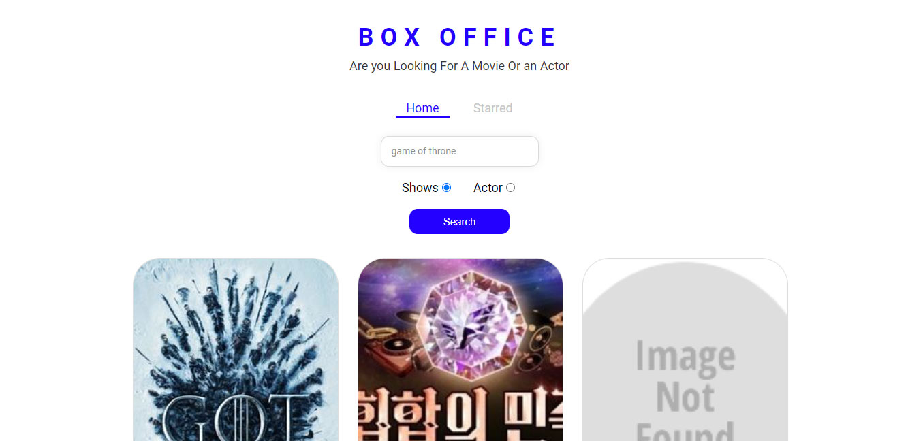

# Getting Started with Create React App

### LINK : https://pratyusa98.github.io/Box_Office_React/#/

_**-----Pic 1-----**_ 

_**-----Pic 2-----**_ 

### How to Use this
1. 1st download this repo as zip
2. Unzip the file 
3. Go inside file and open CMD / git-bash
4. $npm install - It will install all necessary libraries
5. $npm run start - It will run your website in localhots  http://localhost:3000
6. $npm run build - it will create a build/dist folder that you can deploy online
